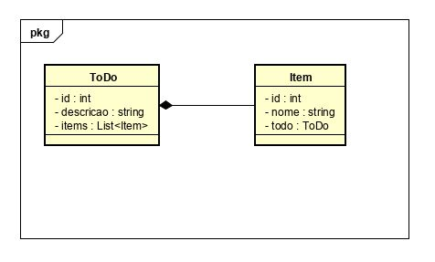
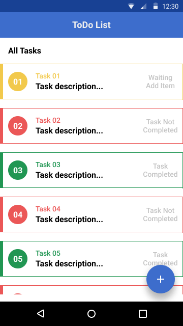
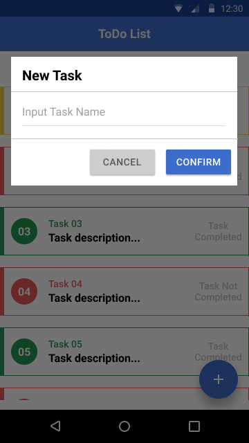
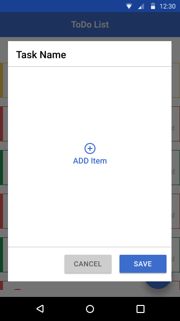
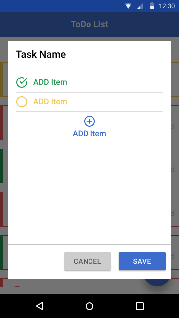
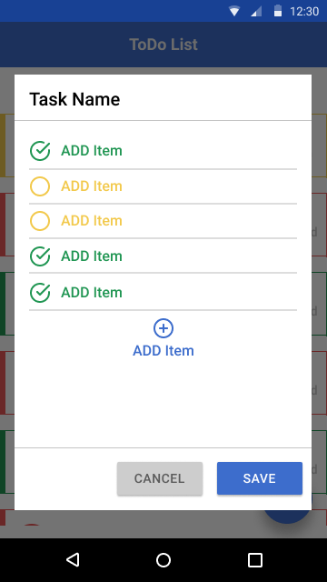
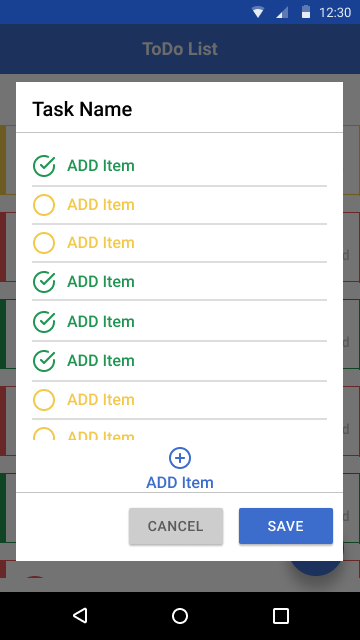
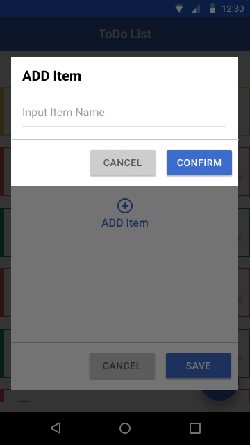

# Projeto ToDo List

O seguinte projeto tem por finalidade fazer uma implementação de ponta a ponta.

## Tecnologias Usadas

-   CSharp (c#) - Será responsável pelo nosso backend em forma de API
-   React Native - Será responsável pela interface do usuário com o sistema

## Diagrama de Classe

## Telas Protótipo

    

    

    
    
    
    

    

